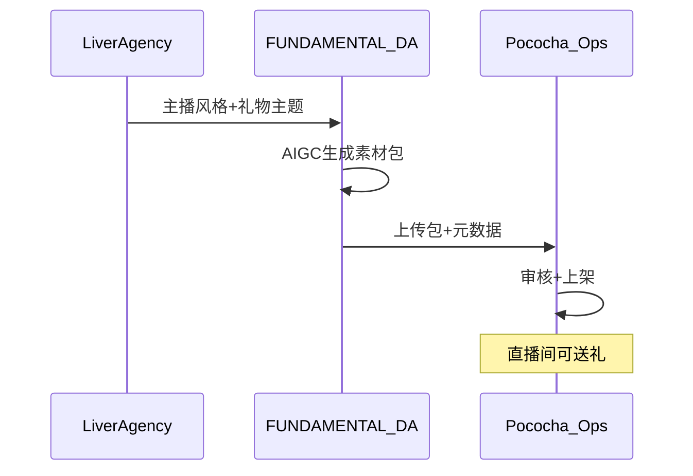

# Pococha 应用内虚拟礼物 — 对接假设清单 v0.1

> **状态**：待 DeNA / Pococha 确认 · **MVP**：仅 Mock + 素材包规范，无真实 API

---

## 1. 业务目标

粉丝在 Pococha 直播间送出 **主播专属虚拟礼物**，强化「絆」；素材由 FUNDAMENTAL DA 基于主播风格 AI 生成，与实体周边同款视觉。

---

## 2. FUNDAMENTAL 侧交付物（Phase 2）

| 交付物 | 说明 |
|--------|------|
| 礼物主图 | PNG/WebP，透明底，多尺寸 |
| 礼物名称 | 日文，≤20 字符 |
| 配色规范 | 主色/辅色 HEX |
| 动效说明 | Lottie / 序列帧需求（若支持） |
| Mock 预览 | `/pococha-virtual-gift` 页面 |

---

## 3. 待 DeNA 确认项

| # | 假设 | 需确认 |
|---|------|--------|
| 1 | 礼物通过 **运营后台上传**，无开放 Creator API | 是否有 Partner API 路线图？ |
| 2 | 素材尺寸 e.g. 256×256、512×512 | 官方规范文档 |
| 3 | 审核周期 5–10 工作日 | SLA |
| 4 | 分成：礼物钻石分成 vs 事务所买断 | 商业模式 |
| 5 | IP：主播肖像授权链 | 合同模板 |
| 6 | 与实体周边 **同款 SKU 绑定** 是否允许 | 产品策略 |
| 7 | 数据：不向第三方传直播间用户 PII | DPA 范围 |

---

## 4. 技术对接草图（假设）

---

## 5. Mock 页面说明

路径：`/pococha-virtual-gift`

- 展示礼物图标预览、尺寸表、假直播间 UI  
- 页脚标注：**概念验证 · 非 Pococha 官方功能**

---

## 6. 与 Phase 1 关系

- **收入与 PMF 验证不依赖** 本模块  
- 作为 DeNA 合作谈判的 **战略期权** 与 **AI-ALL-IN 叙事** 补充
